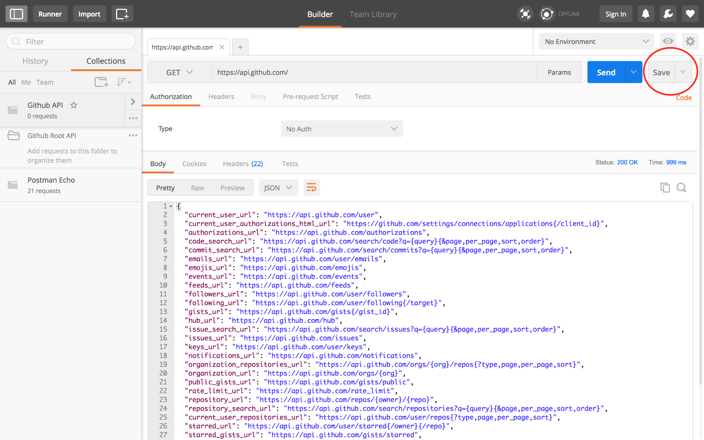
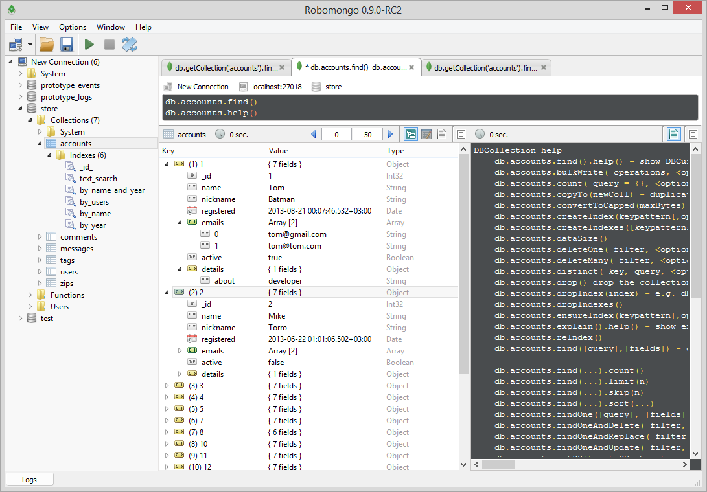

# RESTapi 만들기 (nodeJS, express, passport, mongodb)

## REST(Representational State Transfer) 란?
모든 요청에서 클라이언트의 상태를 URI상에서 의미가 잘 드러나게 전송한다는 의미

## REST api 란?
REST기반의 웹 서비스를 의미하며, HTTP 요청정보의 결과를 단순한 XML이나 JSON등의 포맷으로 반환하는 구조로 이루어져 있습니다.
- 첫 번째, URI는 정보의 자원을 표현해야 한다.
- 두 번째, 자원에 대한 행위는 HTTP Method(GET, POST, PUT, DELETE)로 표현한다.

### ※ example
1. GET http://hosturl/user
```
[
  {
    id: 'abc',
    name: '김아무개',
    age: 34
  },
  {
    id: '1234',
    name: '홍길동',
    age: 55
  },
]
```
2. POST http://hosturl/user/abc
3. PUT http://hosturl/user/abc
4. DELETE http://hosturl/user/abc

## 필요한 기능

1. 회원가입, 로그인 (권한: 모든 사용자)
2. 나의 정보 (권한: 현재 사용자) - `조회 / 수정`
2. 팀 경비관리 (권한: 모든 회원) - `조회 / 등록 / 수정 / 삭제`
3. 결재 기능 (권한: 결재자) - `조회 / 수정 / 삭제`
4. 회원 관리 (권한: 관리자) - `조회 / 수정 / 삭제`


## Instructions
1. Install packages: `npm install`
2. mongodb 실행
3. Launch: `node server.js` or `nodemon`
4. Visit in your browser at: `http://localhost:8080`

## The Tutorials
- [REST API 제대로 알고 사용하기](http://meetup.toast.com/posts/92)
- [Tutorial - Getting Started and Local Authentication](http://scotch.io/tutorials/easy-node-authentication-setup-and-local)
- [GIThub - Getting Started and Local Authentication](https://github.com/scotch-io/easy-node-authentication/)
- [Linking All Accounts Together](http://scotch.io/tutorials/easy-node-authentication-linking-all-accounts-together)

## Test Tools
- [API test Postman](https://scotch.io/tutorials/write-api-tests-with-postman-and-newman)


- [Robo Mongo](https://robomongo.org/)

